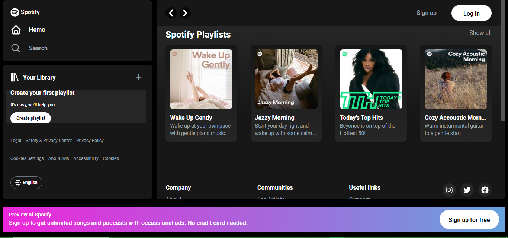
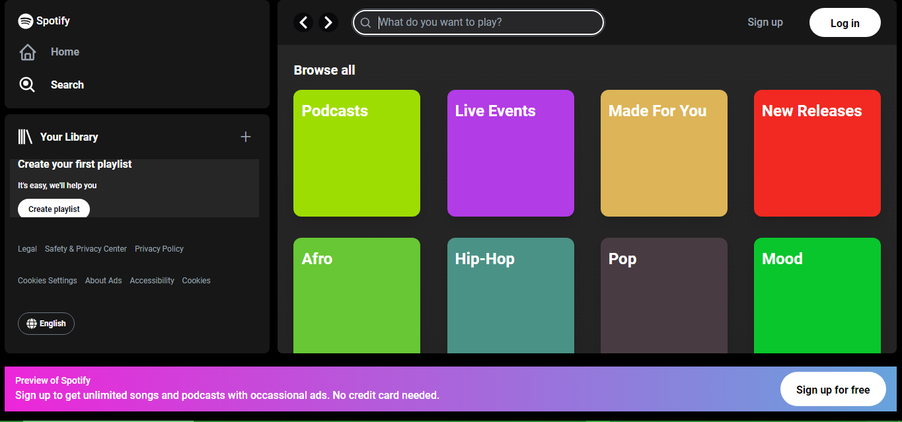

<h1>Spotify</h1>

<h2> Description </h2>
Spotify music website has a great design and great features that sparked my interest and I decided to clone it. It's interactive but not mobile repsonsive.

<h2> Table of Contents </h2>
1. <a href='#tech'>Technologies used</a>  
2. <a href='#view'>Desktop View</a>  
3. <a href='#link'>Live Link</a>  
4. <a href='#author'>Author</a>

<h2 id='tech'> Technologies Used </h2>
<ul>
 <li>React</li>
 <li>Tailwind CSS</li>
 <li>CSS</li>
</ul>

<h2 id='view'> Desktop View </h2>
<h4 style="text-align: center">Home</h4>

<h4 style="text-align: center">Playlists</h4>

<h4 style="text-align: center">Search</h4>

<h4 style="text-align: center">Podcasts</h4>

<h4 style="text-align: center">All Podcast Categories</h4>

<h4 style="text-align: center">Signup</h4>

<h4 style="text-align: center">Login Top</h4>

<h4 style="text-align: center">login Bottom</h4>

<h4 style="text-align: center">Footer</h4>

<h2 id='link'> Live Link </h2>
<a href='https://spotify-ochre-kappa.vercel.app/'> Link </a>

<h2 id='author'> Author </h2>
<a href='https://www.linkedin.com/in/patrick-njiru-7569241ba'>Patrick Njiru</a>

<h2> Copyright </h2>
